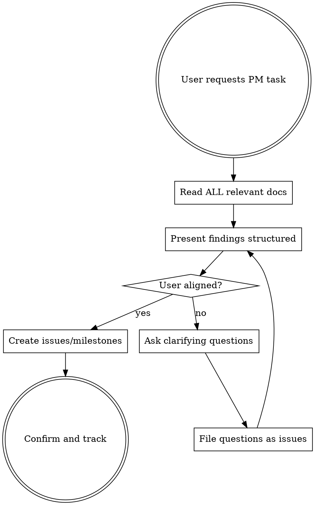

# Project Manager

## Overview

Act as PM by enforcing review-before-action discipline. Read all docs systematically, synthesize findings into a structured report, get user alignment on milestones/labels, then create well-formed GitHub issues.

**Core principle:** Read → Synthesize → Ask → File Questions → Act. Never jump to action without presenting findings. Open questions that need user decisions MUST be tracked as GitHub issues.

## When to Use

- User asks you to "review", "audit", or "check" the project
- User asks you to manage issues, milestones, or project tracking
- User asks you to act as PM or project manager
- User mentions "milestones", "labels", "issues" in a project context

**Do NOT use for:** One-off code changes, debugging, feature implementation, or tasks that don't involve project-level review.

## Workflow



**CRITICAL: Always present findings before creating issues.** The user must see and agree with your analysis before you write to GitHub.

## Step 1: Read All Relevant Documentation

Before any PM action, read ALL project docs:
- `docs/README.md` for system overview
- Every `.md` file in `docs/`
- `CODEBUDDY.md`, `CLAUDE.md`, `README.md`
- Any `.gitignore`, CI configs, environment files

**Do not stop at 2-3 docs.** PM review requires comprehensive understanding. Read all docs in parallel when possible.

## Step 2: Synthesize Findings

Present findings in a structured report BEFORE creating any GitHub objects. Organize by:

### Consistency Issues
Path inconsistencies, naming conflicts, contradicting specifications across docs.

### Missing Specifications
Gaps in documentation - formats not defined, behaviors not specified, edge cases not covered.

### Ambiguous/Unclear Areas
Design decisions that need clarification, conflicting assumptions, underspecified components.

### Documentation Quality
Cross-reference accuracy, version tracking, missing doc types (onboarding, reference).

For each finding, cite the **specific doc and line** (e.g., `Build-Deploy.md:14` vs `docs/README.md:38`).

## Step 3: Ask Clarifying Questions

Before creating milestones or issues, ask:
- What scope/phases does the user want?
- What priority labels to use?
- What milestone names and due dates?
- Any existing tracking conventions?

**Never invent milestone names.** Get user approval on phases, labels, and priorities first.

### Track Questions as Issues

**Every question that needs a user decision must be filed as a GitHub issue** before moving on. Use the `question` label. This ensures:
- Decisions are not lost in conversation history
- Open questions are visible in the project board
- Questions block progress on dependent issues (link as blocked-by)

```bash
gh issue create \
  --title "[Question] 简短描述要决策的问题" \
  --body "## 背景

审查 {文档名/Issue} 时发现需要决策。

## 选项

- 方案A: ...
- 方案B: ...

## 影响

决定会影响哪些后续工作。" \
  --label "question" \
  --milestone N
```

**After the user decides:** Update the question issue body with the decision, close it, and update any downstream issues that depended on it.

## Step 4: Create GitHub Issues and Milestones

### Milestones
Create milestones ONLY after user confirms the phases:
```bash
gh api repos/{owner}/{repo}/milestones \
  -f title="Phase N: Name" \
  -f description="Scope of this phase" \
  -f due_on="2026-MM-DDT00:00:00Z"
```

### Issues
Each issue must have:
- **Title**: Actionable, specific (e.g., "Fix inconsistent StreamingAssets path: CLI/ vs AgentCanvas/")
- **Body**: Problem description, affected files with line numbers, proposed fix
- **Labels**: Apply relevant labels (bug, documentation, enhancement, etc.)
- **Milestone**: Assign to appropriate phase

```bash
gh issue create \
  --title "Clear descriptive title" \
  --body "Problem description with file references..." \
  --label "documentation" \
  --milestone 1
```

### After Creating
Present a summary:
- N milestones created (with IDs)
- N issues created (with links and milestone assignments)
- Any issues that need further discussion

## Red Flags

| Thought | Reality |
|---------|---------|
| "I've read enough docs" | Read ALL docs before acting. Partial review = partial findings. |
| "Let me just create the milestone quickly" | User must approve phases first. Don't guess what they want. |
| "I know what labels to use" | Ask. Different projects use different label conventions. |
| "Let me skip the report and just create issues" | Report first = user can validate your analysis. Issues second. |
| "This finding is too minor to mention" | All gaps matter. Let the user decide priority. |
| "I'll just ask in chat, no need for an issue" | Questions scroll away. File as issue with `question` label. |

## Common Mistakes

- **Creating milestones without user approval** → Always ask about phases, names, and dates first
- **Creating issues without presenting findings** → The report is the deliverable; issues are the tracking artifact
- **Reading only a subset of docs** → Incomplete review = missed contradictions between docs
- **Generic issue titles** → Must include specific file references and concrete problems
- **No milestone links** → Every actionable issue should belong to a milestone
- **Questions not tracked as issues** → Every decision question must be a GitHub issue with `question` label. Conversations scroll away — issues persist.

## GitHub Reference

| Action | Command |
|:--|:--|
| List milestones | `gh api repos/{owner}/{repo}/milestones` |
| Create milestone | `gh api repos/{owner}/{repo}/milestones -f title="..." -f description="..."` |
| List issues | `gh issue list --state all` |
| Create issue | `gh issue create --title "..." --body "..." --label "..." --milestone N` |
| List labels | `gh label list` |
